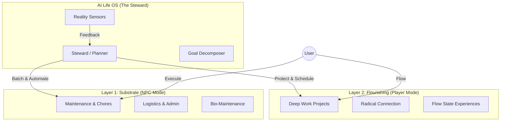

# AI Life OS - Core Design (v3.0 Eudaimonia Guardian Edition)

> **Version**: 3.0
> **Codename**: Eudaimonia Guardian
> **Origin**: `docs/concepts/better_human_blueprint.md` (始终是第一优先级)

## 0. 系统宪章 (System Constitution) 🔐

> **Core Philosophy from Blueprint**: 
> "用机器的纪律来捍卫人类的自由"
> "用前额叶（理智）压倒杏仁核（恐惧/冲动）"

```text
═══════════════════════════════════════════════════════════════
SEMANTIC DEFINITION (关键术语定义):
═══════════════════════════════════════════════════════════════

"Human" in this system refers to the user's
EXPLICITLY ARTICULATED higher-order values (Blueprint Self),
NOT the user's momentary emotional or instinctual states.

The Guardian does not defer to impulses.
It defers only to values.

See: docs/concepts/three_selves_model.md

═══════════════════════════════════════════════════════════════
PRIME DIRECTIVE (源自 better_human_blueprint):
═══════════════════════════════════════════════════════════════

系统的首要职责是帮助用户对抗本能 (Overrule Instincts)。
当用户的即时冲动与长期目标冲突时，系统必须坚持干预。

GUARDIAN PRINCIPLE:
系统是"灵魂的管家"，不是被动的工具。
管家的职责是：在主人想做错事时，温和但坚定地阻止。

INTERVENTION AUTHORITY:
- 当 Instinct Self 劫持用户时 → 系统代表 Blueprint Self 干预
- 当用户被琐事淹没时 → 系统代表 Blueprint Self 重新排序
- 当用户偏离 L2 (Flourishing) 时 → 系统代表 Blueprint Self 提醒

UNCERTAINTY HANDLING:
只有当系统无法判断"用户行为是本能劫持还是 Blueprint Self 的真实意图"时，
才应询问用户确认。

SYSTEM HONESTY:
系统必须诚实呈现自身的不确定性和可能的错误。
但诚实 ≠ 放弃干预。
诚实 = 明确标注"我现在代表的是哪一个你"。
```

---

## 1. 核心哲学 (Philosophy)

**"To Automate the Mundane, so the Extraordinary can Bloom."**
(自动化平庸，只为绽放卓越。)

**"用机器的纪律来捍卫人类的自由。"**

系统追求最大化 **Eudaimonia (幸福/繁荣)** —— 即发挥人类潜能的极致状态。

V1.0 (Ruthless Efficiency) 关注的是 "Doing More".
V2.0 (Eudaimonia) 关注的是 "Being More".
V3.0 (Guardian) 关注的是 "Protecting the Path to Being More".

系统追求 **Dual-Layer Optimization (双层优化)**：
1.  **Layer 1: The Substrate (生存基质)** -> 极致效率 (0 摩擦)。
2.  **Layer 2: The Flourishing (蓬勃生长)** -> 极致体验 (100% 投入)。

---

## 2. 双层架构 (Dual-Layer Architecture)



### 关键组件

#### 2.1 The Steward (管家)
*   **Role**: 系统的核心调度器 (原 Planner 的升级版)。
*   **Responsibility**: 资源分配 (Attention & Time)。
*   **Logic**:
    *   **Big Rocks First**: 优先调度 L2 (Flourishing) 的时间块。
    *   **Gravel Batching**: 将 L1 (Substrate) 任务压缩到低精力窗口 (Logistics Phase) 批量处理。
    *   **Shielding**: 在 L2 session 期间拦截一切 L1 干扰。

#### 2.2 Goal Decomposer (双模态拆解)
*   **L1 Goal (Substrate)**: 拆解为原子化的、无歧义的指令 (NPC Protocol)。
    *   *Prompt*: "Turn this into executable steps."
*   **L2 Goal (Flourishing)**: 拆解为场景、仪式和心流触发器 (Player Protocol)。
    *   *Prompt*: "Design a session for deep engagement."

---

## 3. 协议升级 (Protocol v2.0)

我们重新定义了系统的交互协议，以区分两种模式：

### 3.1 NPC Protocol v2.0 (For Substrate)
**适用范围**: 杂务、运维、物流。
**原则**: **Zero Cognitive Load (零认知负荷)**。

*   **指令风格**: 绝对指令。
    *   ❌ "想办法修好打印机"
    *   ✅ "1. 搜索错误码 X; 2. 只有京东下单配件 Y"
*   **失败处理**: 快速 Fail，请求人类短暂介入，然后恢复自动化。

### 3.2 Player Protocol (For Flourishing)
**适用范围**: 创作、学习、社交。
**原则**: **High Cognitive Engagement (高认知投入)**。

*   **指令风格**: 脚手架与仪式。
    *   "现在是深度写作时间。背景音乐已设为 Bach。请专注于 Chapter 3 的核心论点。"
*   **失败处理**: 鼓励探索，没有"错误"，只有"迭代"。

---

## 4. RIPER Compliance (规则遵循)

本设计文档及所有代码实现必须严格遵循 RIPER 原则：

*   **R (Reference-based)**: 所有决策基于 `docs/concepts/better_human_blueprint.md`。
*   **I (Input-driven)**: 系统的任何动作必须有明确的 Trigger (Time, Event, Sensor)。
*   **P (Probabilistic)**: 允许不确定性，但必须显式建模信心分数 (Confidence Score)。
*   **E (Explicit)**:
    *   **Configuration**: 所有魔法数字 (如 MIN_TASK_DURATION) 必须在 `core/config_manager.py` 中定义并注释推导来源。
    *   **Causal Chain**: 必须能解释 "Why did the Steward schedule this now?"。
*   **R (Robustness)**:
    *   L1 任务失败不应崩溃系统。
    *   L2 任务若无法进入心流，应建议降级为 L1 休息。

---

## 5. 路线图 (Roadmap)

1.  **Phase 1: Foundation** (Done)
    *   建立 Python 核心 (`core/`)。
    *   实现基础 Event Sourcing。

2.  **Phase 2: The Split (Done)**
    *   重构 `Planner` 为 `Steward`。
    *   实现 L1/L2 目标分类体系。
    *   升级 `core_design.md` 至 v2.0。

3.  **Phase 3: The Senses**
    *   接入更多 Reality Sensors (文件监控, API, location)。

4.  **Phase 4: The Interface**
    *   开发 CLI 和 Web UI，区分 "Admin Dashboard" (L1) 和 "Focus Mode" (L2)。
